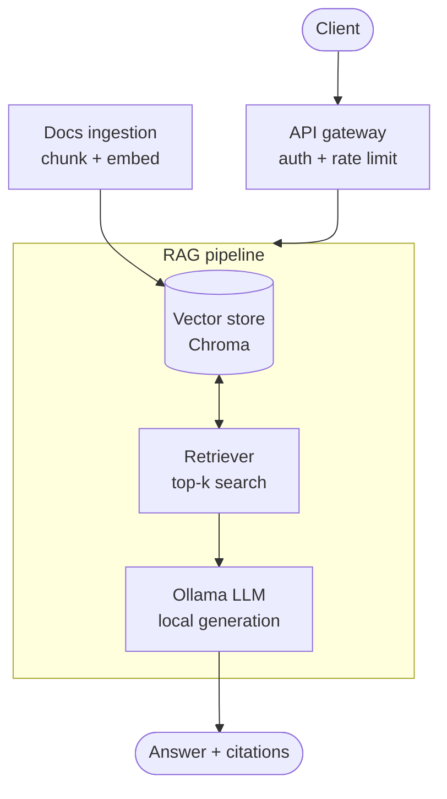

# DocuChat AI

A production-style Retrieval-Augmented Generation (RAG) assistant for internal
document Q&A — ask questions about your company handbook, policies, or any
knowledge base in plain English and get grounded, cited answers from a
**local, free LLM** (via [Ollama](https://ollama.com)). No OpenAI/Anthropic
API key or cost required.

Built to demonstrate the full lifecycle of a real AI product: ingestion,
retrieval, generation, agentic tool-use, evaluation, auth, observability,
containerization, and CI/CD — not just a notebook that calls an LLM.

## Why this exists

Most "RAG tutorial" projects are a Jupyter notebook that calls `openai.chat.completions.create()`
on top of a LangChain retriever. This project is scoped instead around the
questions an AI Engineering interview actually asks:

- How do you chunk documents, and why that chunk size/overlap?
- How do you know your retrieval is actually good? (not vibes — a metric)
- What happens when the LLM needs to use a tool, not just answer from context?
- How is this deployed, tested, and observed once it's not just running on your laptop?

Every one of those questions has a concrete, inspectable answer in this repo.

## Architecture



**Request flow:** a client calls `/chat` with an API key → the gateway
authenticates and rate-limits the request → the retriever embeds the query
and searches Chroma for the top-k most similar chunks → those chunks are
assembled into a grounded prompt → a local Ollama model generates a cited
answer → the response (with source chunks and scores) streams back to the
client.

**Ingestion is a separate, offline path**: documents are chunked, embedded,
and written to the vector store ahead of time (via a CLI script or the
`/documents/ingest` endpoint), so query-time latency is just retrieval +
generation.

## Features

| Area | What's implemented |
|---|---|
| **Ingestion** | Hand-written recursive chunker with sentence-boundary awareness and sliding overlap (`app/rag/ingestion.py`) — not a black-box library call |
| **Retrieval** | Embedding via `sentence-transformers`, persistent vector search via ChromaDB, cosine similarity scoring |
| **Generation** | Grounded prompting with numbered source citations `[1]`, `[2]`, streaming support (SSE) |
| **Agent** | A hand-rolled ReAct-style tool-calling loop (JSON-based, works with any instruction-following local model) with a `search_docs` tool and a sandboxed `calculator` tool |
| **Evaluation** | Custom harness measuring retrieval hit rate and answer keyword recall against a labeled 10-question eval set — no dependency on a hosted judge LLM |
| **Auth** | API key header auth (`X-API-Key`), swappable for OAuth2/JWT later |
| **Rate limiting** | Per-IP rate limiting via `slowapi` |
| **Observability** | Structured JSON logging (`structlog`) with request IDs and per-request latency on every log line |
| **Testing** | 23 unit + integration tests, dependency-injected mocks so tests run without Ollama or a real embedding model |
| **CI/CD** | GitHub Actions: lint (`ruff`) → test (`pytest`) → Docker build |
| **Deployment** | Dockerfile + `docker-compose.yml` running the API alongside an Ollama container |

## Tech stack

Python 3.11 · FastAPI · Pydantic v2 · ChromaDB · sentence-transformers ·
Ollama · structlog · slowapi · pytest · Docker · GitHub Actions

## Project structure

```
docuchat-ai/
├── app/
│   ├── main.py                 # FastAPI app, middleware, exception handling
│   ├── config.py                # Settings (env-driven)
│   ├── api/
│   │   ├── deps.py               # Dependency-injected singletons
│   │   └── routes/                # /health, /chat, /chat/stream, /chat/agent, /documents
│   ├── core/
│   │   ├── security.py           # API key auth
│   │   └── logging.py            # Structured logging
│   ├── models/schemas.py        # Pydantic request/response contracts
│   └── rag/
│       ├── ingestion.py          # Chunking (hand-written)
│       ├── embeddings.py         # sentence-transformers wrapper
│       ├── vectorstore.py        # ChromaDB wrapper
│       ├── llm.py                # Ollama HTTP client
│       ├── pipeline.py           # Retrieve -> prompt -> generate
│       ├── agent.py              # ReAct-style tool-calling loop
│       └── tools/                # calculator, search_docs
├── data/sample_docs/            # Example company-policy docs for the demo
├── evaluation/                  # Eval dataset + harness
├── scripts/ingest_docs.py       # CLI ingestion
├── tests/                       # Unit + integration tests
├── .github/workflows/ci.yml     # CI pipeline
├── Dockerfile / docker-compose.yml
└── requirements.txt
```

## Getting started

### Option A: Docker Compose (recommended)

```bash
git clone <your-repo-url> && cd docuchat-ai
docker compose up -d

# Pull a model into the Ollama container (one-time)
docker compose exec ollama ollama pull llama3.1

# Ingest the sample docs
curl -X POST http://localhost:8000/documents/ingest \
  -H "X-API-Key: devkey123" \
  -F "files=@data/sample_docs/remote_work_policy.md" \
  -F "files=@data/sample_docs/expense_policy.md" \
  -F "files=@data/sample_docs/onboarding_guide.md"

# Ask a question
curl -X POST http://localhost:8000/chat \
  -H "Content-Type: application/json" -H "X-API-Key: devkey123" \
  -d '{"query": "How many days can I work remotely?"}'
```

### Option B: Local Python

```bash
# 1. Install Ollama and pull a model: https://ollama.com/download
ollama pull llama3.1

# 2. Set up the app
python -m venv venv && source venv/bin/activate
pip install -r requirements-dev.txt
cp .env.example .env

# 3. Ingest the sample knowledge base
python -m scripts.ingest_docs --path data/sample_docs

# 4. Run the API
uvicorn app.main:app --reload

# 5. Try it
curl -X POST http://localhost:8000/chat \
  -H "Content-Type: application/json" -H "X-API-Key: devkey123" \
  -d '{"query": "What is the probationary period?"}'
```

Interactive API docs (Swagger UI) are at `http://localhost:8000/docs`.

## API reference

| Endpoint | Method | Description |
|---|---|---|
| `/health` | GET | Service + vector store + Ollama connectivity status |
| `/chat` | POST | Ask a question, get a grounded answer with sources |
| `/chat/stream` | POST | Same, streamed token-by-token via SSE |
| `/chat/agent` | POST | Ask a question with agentic tool-use (search + calculator), returns the full reasoning trace |
| `/documents/ingest` | POST | Upload files to chunk, embed, and index |
| `/documents/count` | GET | Number of chunks currently indexed |

All endpoints except `/health` require an `X-API-Key` header.

### Example: agent with tool use

```bash
curl -X POST http://localhost:8000/chat/agent \
  -H "Content-Type: application/json" -H "X-API-Key: devkey123" \
  -d '{"query": "If the meal budget is $75/day, what is that for a 5-day trip?"}'
```

Returns the final answer **and** the step-by-step trace (thought → action →
observation) the agent took to get there — useful for both debugging and for
demonstrating "the model doesn't just hallucinate a number, it called the
calculator tool" in an interview.

## Evaluation

```bash
python -m evaluation.evaluate
```

Runs 10 labeled questions against the pipeline and reports:

- **Retrieval hit rate** — did the retriever surface a chunk containing the
  expected answer?
- **Answer keyword recall** — did the generated answer actually contain the
  expected facts?
- **Average latency** per question

This is the artifact to point to when a resume bullet says "improved
retrieval accuracy" — rerun the eval after changing chunk size, embedding
model, or top-k, and diff the numbers.

## Testing

```bash
pytest tests/ -v          # 23 tests, no Ollama/embedding model required (mocked)
ruff check app tests       # lint
```

Integration tests use FastAPI's dependency-override mechanism to swap in fake
pipeline/vector-store/LLM implementations, so the test suite runs in seconds
in CI without needing a GPU, a model download, or a running Ollama instance.

## Extending this project

Ideas that build naturally on this foundation, if you want to keep going:

- Swap ChromaDB for Qdrant or pgvector and benchmark retrieval latency
- Add a cross-encoder reranking step after initial retrieval
- Add a `/feedback` endpoint and use thumbs up/down to build a fine-tuning or
  few-shot example dataset
- Add token/cost tracking per request (even for a local model, tracking
  tokens-per-second is a legitimate production metric)
- Front it with a small React or Streamlit chat UI

## Putting this on your resume

Some honest, specific bullet points this project supports (fill in your own
measured numbers from the eval harness):

- *"Built and deployed a production-style RAG system (FastAPI, ChromaDB,
  Ollama) with a hand-implemented chunking and retrieval pipeline, achieving
  an X% retrieval hit rate on a labeled evaluation set."*
- *"Implemented a ReAct-style tool-calling agent from first principles
  (prompt-based JSON action parsing) enabling the assistant to invoke
  external tools rather than relying on provider-specific function calling."*
- *"Built an automated evaluation harness to measure retrieval accuracy and
  answer quality, enabling data-driven iteration on chunking strategy and
  retrieval parameters."*
- *"Containerized and deployed the system with Docker Compose and a CI/CD
  pipeline (GitHub Actions) running linting, a 23-test suite, and a Docker
  build on every pull request."*

Be ready to explain *why* you made each choice (chunk size, overlap
strategy, why ChromaDB, why a hand-rolled agent loop) — that's what these
choices are for.

## License

MIT — use this however is useful to you.
